# 📋 Documentación Técnica - Skill Assessment Service
## Guía de Integración para Desarrollo Móvil Flutter

**Versión:** 1.0.0  
**Fecha:** Enero 2024  
**Base URL:** `https://teching.tech/skillassement/`  
**Autenticación:** JWT Bearer Token  

---

## 📑 Tabla de Contenidos

1. [Información General](#información-general)
2. [Autenticación](#autenticación)
3. [Arquitectura del Flujo](#arquitectura-del-flujo)
4. [Endpoints Detallados](#endpoints-detallados)
5. [Flujo Completo de Evaluación](#flujo-completo-de-evaluación)
6. [Modelos de Datos](#modelos-de-datos)
7. [Manejo de Errores](#manejo-de-errores)
8. [Ejemplos de Implementación](#ejemplos-de-implementación)
9. [Testing y Validación](#testing-y-validación)
10. [Consideraciones de Performance](#consideraciones-de-performance)

---

## 1. Información General

### 🎯 Propósito del Servicio
El **Skill Assessment Service** es un microservicio que permite crear y gestionar evaluaciones de habilidades técnicas mediante cuestionarios generados automáticamente con inteligencia artificial.

### 🏗️ Arquitectura
- **Framework:** FastAPI con arquitectura hexagonal
- **Base de datos:** MongoDB
- **IA:** Google Gemini para generación de preguntas
- **Mensajería:** RabbitMQ para notificaciones
- **Gateway:** Kong API Gateway con protección JWT

### 🌐 URL Base y Estructura
```
Base URL: https://teching.tech/skillassement/
API Version: v1
Full endpoint: https://teching.tech/skillassement/api/v1/{endpoint}
```

---

## 2. Autenticación

### 🔐 JWT Bearer Token
Todos los endpoints (excepto health check) requieren autenticación JWT.

#### Headers Requeridos:
```http
Authorization: Bearer {jwt_token}
Content-Type: application/json
Accept: application/json
```

#### Estructura del Token JWT:
```json
{
  "sub": "user_id",
  "exp": 1640995200,
  "iat": 1640908800,
  "iss": "teching-platform",
  "aud": "skill-assessment"
}
```

#### Ejemplo de Implementación en Flutter:
```dart
// Configuración de headers
Map<String, String> getHeaders(String token) {
  return {
    'Authorization': 'Bearer $token',
    'Content-Type': 'application/json',
    'Accept': 'application/json',
  };
}
```

---

## 3. Arquitectura del Flujo

### 🔄 Diagrama de Flujo Principal

```mermaid
graph TD
    A[Autenticación JWT] --> B[Listar Habilidades]
    B --> C[Seleccionar Habilidad]
    C --> D[Iniciar Evaluación]
    D --> E[Obtener Session ID]
    E --> F[Ciclo de Preguntas]
    F --> G[Mostrar Pregunta]
    G --> H[Responder]
    H --> I{¿Más Preguntas?}
    I -->|Sí| F
    I -->|No| J[Generar Feedback]
    J --> K[Mostrar Resultados]
    K --> L[Guardar en Historial]
```



### 📱 Estados de la Aplicación Móvil

| Estado | Descripción | Endpoints Involucrados |
|--------|-------------|------------------------|
| `INITIAL` | Carga inicial de habilidades | `GET /api/v1/skills/` |
| `SKILL_SELECTED` | Habilidad seleccionada | `GET /api/v1/{skill_id}` |
| `ASSESSMENT_STARTING` | Iniciando evaluación | `POST /api/v1/assement/{skill_id}` |
| `QUESTION_LOADING` | Cargando pregunta | `GET /api/v1/assement/questions/{id}` |
| `ANSWERING` | Usuario respondiendo | - |
| `SUBMITTING_ANSWER` | Enviando respuesta | `POST /api/v1/assement/questions/{id}` |
| `GENERATING_FEEDBACK` | Generando feedback | `GET /api/v1/assement/feedback/{session_id}` |
| `COMPLETED` | Evaluación completada | `GET /api/v1/assement/feedbacks/{user_id}` |

---

## 4. Endpoints Detallados

### 🏥 Health Check
Verificación de estado del servicio (NO requiere autenticación).

```http
GET https://teching.tech/skillassement/
```

**Response 200:**
```json
{
  "status": "ok",
  "service": "skill-assessment-service",
  "message": "Servicio funcionando correctamente"
}
```

---

### 📚 Gestión de Habilidades

#### 4.1 Listar Habilidades Disponibles
```http
GET https://teching.tech/skillassement/api/v1/skills/
```

**Query Parameters:**
- `skip` (int, opcional): Elementos a omitir (default: 0)
- `limit` (int, opcional): Máximo elementos (default: 10, max: 100)

**Headers:**
```http
Authorization: Bearer {jwt_token}
```

**Response 200:**
```json
{
  "skills": [
    {
      "id": "507f1f77bcf86cd799439011",
      "name": "JavaScript Fundamentals",
      "description": "Conceptos básicos de JavaScript para desarrollo web",
      "category": "Frontend",
      "difficulty": "beginner",
      "created_at": "2024-01-15T10:30:00Z",
      "estimated_duration": 15,
      "question_count": 10
    }
  ],
  "total": 25,
  "skip": 0,
  "limit": 10,
  "has_more": true
}
```

#### 4.2 Obtener Habilidad Específica
```http
GET https://teching.tech/skillassement/api/v1/{skill_id}
```

**Path Parameters:**
- `skill_id` (string): ID único de la habilidad

**Response 200:**
```json
{
  "id": "507f1f77bcf86cd799439011",
  "name": "JavaScript Fundamentals",
  "description": "Evaluación de conocimientos fundamentales en JavaScript...",
  "category": "Frontend",
  "difficulty": "beginner",
  "created_at": "2024-01-15T10:30:00Z",
  "estimated_duration": 15,
  "question_count": 10,
  "topics": [
    "Variables y tipos de datos",
    "Funciones",
    "DOM manipulation",
    "Event handling"
  ]
}
```

---

### 📝 Gestión de Evaluaciones

#### 4.3 Iniciar Nueva Evaluación
```http
POST https://teching.tech/skillassement/api/v1/assement/{skill_id}
```

**Path Parameters:**
- `skill_id` (string): ID de la habilidad a evaluar

**Request Body:**
```json
{
  "id_user": "user_12345"
}
```

**Response 201:**
```json
{
  "message": "Assessment generated successfully",
  "Assessment": {
    "session_id": "sess_abc123def456",
    "skill_id": "507f1f77bcf86cd799439011",
    "user_id": "user_12345",
    "total_questions": 10,
    "current_question": 1,
    "status": "in_progress",
    "created_at": "2024-01-15T14:30:00Z",
    "expires_at": "2024-01-15T16:30:00Z"
  },
  "next_step": 1
}
```

#### 4.4 Obtener Información de Sesión
```http
GET https://teching.tech/skillassement/api/v1/assement/session/{session_id}
```

**Response 200:**
```json
{
  "id": "sess_abc123def456",
  "user_id": "user_12345",
  "skill_id": "507f1f77bcf86cd799439011",
  "status": "in_progress",
  "current_question": 3,
  "total_questions": 10,
  "answered_questions": 2,
  "created_at": "2024-01-15T14:30:00Z",
  "expires_at": "2024-01-15T16:30:00Z",
  "progress_percentage": 20
}
```

---

### ❓ Gestión de Preguntas

#### 4.5 Obtener Pregunta Específica
```http
GET https://teching.tech/skillassement/api/v1/assement/questions/{question_id}
```

**Path Parameters:**
- `question_id` (int): Número de la pregunta (1-N)

**Query Parameters:**
- `id_user` (string): ID del usuario
- `id_session` (string): ID de la sesión

**Response 200:**
```json
{
  "id": 1,
  "session_id": "sess_abc123def456",
  "question": "¿Cuál es la diferencia entre 'let' y 'var' en JavaScript?",
  "type": "multiple_choice",
  "options": [
    "let tiene scope de bloque, var tiene scope de función",
    "let es más rápido que var",
    "No hay diferencia",
    "var es más moderno que let"
  ],
  "question_number": 1,
  "total_questions": 10,
  "time_limit": 300,
  "difficulty": "intermediate",
  "topic": "Variables y Scope"
}
```

#### 4.6 Responder Pregunta
```http
POST https://teching.tech/skillassement/api/v1/assement/questions/{question_id}
```

**Request Body:**
```json
{
  "id_session": "sess_abc123def456",
  "id_user": "user_12345",
  "answer": "let tiene scope de bloque, var tiene scope de función"
}
```

**Response 201:**
```json
{
  "message": "Answer recorded successfully",
  "question_id": 1,
  "next_question": 2,
  "is_complete": false,
  "progress": {
    "current": 2,
    "total": 10,
    "percentage": 20
  },
  "time_taken": 45
}
```

#### 4.7 Actualizar Respuesta
```http
PUT https://teching.tech/skillassement/api/v1/assement/questions/{question_id}
```

**Request Body:**
```json
{
  "id_session": "sess_abc123def456",
  "id_user": "user_12345",
  "answer": "Nueva respuesta corregida"
}
```

**Response 200:**
```json
{
  "message": "Answer updated successfully",
  "question_id": 1,
  "updated_at": "2024-01-15T14:45:00Z"
}
```

---

### 📊 Gestión de Feedback

#### 4.8 Generar y Obtener Feedback
```http
GET https://teching.tech/skillassement/api/v1/assement/feedback/{session_id}
```

**Response 200:**
```json
{
  "session_id": "sess_abc123def456",
  "feedback": {
    "overall_score": 85,
    "percentage": 85,
    "level": "intermediate",
    "grade": "B+",
    "passed": true,
    "strengths": [
      "Excelente comprensión de variables y scope",
      "Buen manejo de funciones básicas"
    ],
    "areas_for_improvement": [
      "Async/await y promesas",
      "Manipulación avanzada del DOM"
    ],
    "recommendations": [
      "Practicar programación asíncrona",
      "Estudiar patrones de diseño en JavaScript",
      "Realizar proyectos con APIs REST"
    ],
    "topic_breakdown": {
      "Variables y Scope": {
        "score": 90,
        "questions_answered": 3,
        "questions_correct": 3
      },
      "Funciones": {
        "score": 80,
        "questions_answered": 2,
        "questions_correct": 2
      },
      "DOM Manipulation": {
        "score": 75,
        "questions_answered": 3,
        "questions_correct": 2
      },
      "Event Handling": {
        "score": 85,
        "questions_answered": 2,
        "questions_correct": 2
      }
    }
  },
  "completion_time": 720,
  "generated_at": "2024-01-15T15:15:00Z"
}
```

#### 4.9 Obtener Historial de Feedbacks del Usuario
```http
GET https://teching.tech/skillassement/api/v1/assement/feedbacks/{user_id}
```

**Query Parameters:**
- `skip` (int): Elementos a omitir
- `limit` (int): Máximo elementos

**Response 200:**
```json
{
  "feedbacks": [
    {
      "id": "feedback_xyz789",
      "skill_name": "JavaScript Fundamentals",
      "skill_id": "507f1f77bcf86cd799439011",
      "score": 85,
      "percentage": 85,
      "level": "intermediate",
      "grade": "B+",
      "completion_time": 720,
      "created_at": "2024-01-15T15:15:00Z"
    }
  ],
  "total": 5,
  "skip": 0,
  "limit": 10,
  "user_stats": {
    "total_assessments": 5,
    "average_score": 78,
    "best_score": 92,
    "favorite_category": "Frontend",
    "total_time_spent": 3600
  }
}
```

#### 4.10 Obtener Feedback Específico
```http
GET https://teching.tech/skillassement/api/v1/assement/feedback/assement/{feedback_id}
```

**Response 200:**
```json
{
  "id": "feedback_xyz789",
  "session_id": "sess_abc123def456",
  "user_id": "user_12345",
  "skill_name": "JavaScript Fundamentals",
  "skill_id": "507f1f77bcf86cd799439011",
  "score": 85,
  "percentage": 85,
  "level": "intermediate",
  "grade": "B+",
  "detailed_feedback": {
    "strengths": ["Variables y Scope", "Funciones básicas"],
    "areas_for_improvement": ["Async/await", "DOM avanzado"],
    "recommendations": ["Practicar promesas", "Estudiar eventos"]
  },
  "questions_summary": {
    "total": 10,
    "correct": 8,
    "incorrect": 2,
    "average_time_per_question": 72
  },
  "created_at": "2024-01-15T15:15:00Z"
}
```

---

## 5. Flujo Completo de Evaluación

### 🔄 Implementación Paso a Paso

#### Paso 1: Inicialización
```dart
class SkillAssessmentService {
  static const String baseUrl = 'https://teching.tech/skillassement/api/v1';
  final String _token;
  
  SkillAssessmentService(this._token);
  
  Map<String, String> get _headers => {
    'Authorization': 'Bearer $_token',
    'Content-Type': 'application/json',
  };
}
```

#### Paso 2: Listar y Seleccionar Habilidades
```dart
Future<List<Skill>> getAvailableSkills({int skip = 0, int limit = 10}) async {
  final response = await http.get(
    Uri.parse('$baseUrl/skills/?skip=$skip&limit=$limit'),
    headers: _headers,
  );
  
  if (response.statusCode == 200) {
    final data = json.decode(response.body);
    return (data['skills'] as List)
        .map((skill) => Skill.fromJson(skill))
        .toList();
  }
  throw SkillAssessmentException('Error loading skills');
}
```

#### Paso 3: Iniciar Evaluación
```dart
Future<AssessmentSession> startAssessment(String skillId, String userId) async {
  final response = await http.post(
    Uri.parse('$baseUrl/assement/$skillId'),
    headers: _headers,
    body: json.encode({'id_user': userId}),
  );
  
  if (response.statusCode == 201) {
    final data = json.decode(response.body);
    return AssessmentSession.fromJson(data['Assessment']);
  }
  throw SkillAssessmentException('Error starting assessment');
}
```

#### Paso 4: Ciclo de Preguntas
```dart
Future<Question> getQuestion(int questionId, String sessionId, String userId) async {
  final uri = Uri.parse('$baseUrl/assement/questions/$questionId')
      .replace(queryParameters: {
    'id_session': sessionId,
    'id_user': userId,
  });
  
  final response = await http.get(uri, headers: _headers);
  
  if (response.statusCode == 200) {
    return Question.fromJson(json.decode(response.body));
  }
  throw SkillAssessmentException('Error loading question');
}

Future<AnswerResult> submitAnswer(
  int questionId,
  String sessionId,
  String userId,
  String answer,
) async {
  final response = await http.post(
    Uri.parse('$baseUrl/assement/questions/$questionId'),
    headers: _headers,
    body: json.encode({
      'id_session': sessionId,
      'id_user': userId,
      'answer': answer,
    }),
  );
  
  if (response.statusCode == 201) {
    return AnswerResult.fromJson(json.decode(response.body));
  }
  throw SkillAssessmentException('Error submitting answer');
}
```

#### Paso 5: Obtener Feedback
```dart
Future<AssessmentFeedback> getFeedback(String sessionId) async {
  final response = await http.get(
    Uri.parse('$baseUrl/assement/feedback/$sessionId'),
    headers: _headers,
  );
  
  if (response.statusCode == 200) {
    return AssessmentFeedback.fromJson(json.decode(response.body));
  }
  throw SkillAssessmentException('Error generating feedback');
}
```

---

## 6. Modelos de Datos

### 📦 Modelos Flutter/Dart

```dart
class Skill {
  final String id;
  final String name;
  final String description;
  final String category;
  final String difficulty;
  final DateTime createdAt;
  final int estimatedDuration;
  final int questionCount;
  final List<String> topics;

  Skill({
    required this.id,
    required this.name,
    required this.description,
    required this.category,
    required this.difficulty,
    required this.createdAt,
    required this.estimatedDuration,
    required this.questionCount,
    required this.topics,
  });

  factory Skill.fromJson(Map<String, dynamic> json) {
    return Skill(
      id: json['id'],
      name: json['name'],
      description: json['description'],
      category: json['category'],
      difficulty: json['difficulty'],
      createdAt: DateTime.parse(json['created_at']),
      estimatedDuration: json['estimated_duration'] ?? 15,
      questionCount: json['question_count'] ?? 10,
      topics: List<String>.from(json['topics'] ?? []),
    );
  }
}

class AssessmentSession {
  final String sessionId;
  final String skillId;
  final String userId;
  final int totalQuestions;
  final int currentQuestion;
  final String status;
  final DateTime createdAt;
  final DateTime expiresAt;

  AssessmentSession({
    required this.sessionId,
    required this.skillId,
    required this.userId,
    required this.totalQuestions,
    required this.currentQuestion,
    required this.status,
    required this.createdAt,
    required this.expiresAt,
  });

  factory AssessmentSession.fromJson(Map<String, dynamic> json) {
    return AssessmentSession(
      sessionId: json['session_id'],
      skillId: json['skill_id'],
      userId: json['user_id'],
      totalQuestions: json['total_questions'],
      currentQuestion: json['current_question'],
      status: json['status'],
      createdAt: DateTime.parse(json['created_at']),
      expiresAt: DateTime.parse(json['expires_at']),
    );
  }
}

class Question {
  final int id;
  final String sessionId;
  final String question;
  final String type;
  final List<String> options;
  final int questionNumber;
  final int totalQuestions;
  final int timeLimit;
  final String difficulty;
  final String topic;

  Question({
    required this.id,
    required this.sessionId,
    required this.question,
    required this.type,
    required this.options,
    required this.questionNumber,
    required this.totalQuestions,
    required this.timeLimit,
    required this.difficulty,
    required this.topic,
  });

  factory Question.fromJson(Map<String, dynamic> json) {
    return Question(
      id: json['id'],
      sessionId: json['session_id'],
      question: json['question'],
      type: json['type'],
      options: List<String>.from(json['options']),
      questionNumber: json['question_number'],
      totalQuestions: json['total_questions'],
      timeLimit: json['time_limit'],
      difficulty: json['difficulty'],
      topic: json['topic'],
    );
  }
}

class AssessmentFeedback {
  final String sessionId;
  final FeedbackDetails feedback;
  final int completionTime;
  final DateTime generatedAt;

  AssessmentFeedback({
    required this.sessionId,
    required this.feedback,
    required this.completionTime,
    required this.generatedAt,
  });

  factory AssessmentFeedback.fromJson(Map<String, dynamic> json) {
    return AssessmentFeedback(
      sessionId: json['session_id'],
      feedback: FeedbackDetails.fromJson(json['feedback']),
      completionTime: json['completion_time'],
      generatedAt: DateTime.parse(json['generated_at']),
    );
  }
}

class FeedbackDetails {
  final int overallScore;
  final int percentage;
  final String level;
  final String grade;
  final bool passed;
  final List<String> strengths;
  final List<String> areasForImprovement;
  final List<String> recommendations;
  final Map<String, TopicScore> topicBreakdown;

  FeedbackDetails({
    required this.overallScore,
    required this.percentage,
    required this.level,
    required this.grade,
    required this.passed,
    required this.strengths,
    required this.areasForImprovement,
    required this.recommendations,
    required this.topicBreakdown,
  });

  factory FeedbackDetails.fromJson(Map<String, dynamic> json) {
    return FeedbackDetails(
      overallScore: json['overall_score'],
      percentage: json['percentage'],
      level: json['level'],
      grade: json['grade'],
      passed: json['passed'],
      strengths: List<String>.from(json['strengths']),
      areasForImprovement: List<String>.from(json['areas_for_improvement']),
      recommendations: List<String>.from(json['recommendations']),
      topicBreakdown: (json['topic_breakdown'] as Map<String, dynamic>)
          .map((key, value) => MapEntry(key, TopicScore.fromJson(value))),
    );
  }
}
```

---

## 7. Manejo de Errores

### 🚨 Códigos de Estado HTTP

| Código | Descripción | Acción Recomendada |
|--------|-------------|-------------------|
| `200` | OK | Continuar flujo normal |
| `201` | Created | Recurso creado exitosamente |
| `400` | Bad Request | Validar datos de entrada |
| `401` | Unauthorized | Renovar token JWT |
| `403` | Forbidden | Verificar permisos |
| `404` | Not Found | Recurso no existe |
| `429` | Too Many Requests | Implementar retry con backoff |
| `500` | Internal Server Error | Mostrar error genérico |

### 🔧 Implementación de Manejo de Errores

```dart
class SkillAssessmentException implements Exception {
  final String message;
  final int? statusCode;
  final String? errorCode;

  SkillAssessmentException(this.message, {this.statusCode, this.errorCode});
}

class ErrorHandler {
  static SkillAssessmentException handleHttpError(http.Response response) {
    switch (response.statusCode) {
      case 401:
        return SkillAssessmentException(
          'Token expirado. Por favor, inicia sesión nuevamente.',
          statusCode: 401,
          errorCode: 'TOKEN_EXPIRED',
        );
      case 403:
        return SkillAssessmentException(
          'No tienes permisos para realizar esta acción.',
          statusCode: 403,
          errorCode: 'FORBIDDEN',
        );
      case 404:
        return SkillAssessmentException(
          'El recurso solicitado no fue encontrado.',
          statusCode: 404,
          errorCode: 'NOT_FOUND',
        );
      case 429:
        return SkillAssessmentException(
          'Demasiadas solicitudes. Intenta nuevamente en unos segundos.',
          statusCode: 429,
          errorCode: 'RATE_LIMIT',
        );
      default:
        return SkillAssessmentException(
          'Error del servidor. Intenta nuevamente.',
          statusCode: response.statusCode,
          errorCode: 'SERVER_ERROR',
        );
    }
  }
}
```

---

## 8. Ejemplos de Implementación

### 📱 Widget de Evaluación Completa

```dart
class AssessmentWidget extends StatefulWidget {
  final String skillId;
  final String userId;

  const AssessmentWidget({
    Key? key,
    required this.skillId,
    required this.userId,
  }) : super(key: key);

  @override
  _AssessmentWidgetState createState() => _AssessmentWidgetState();
}

class _AssessmentWidgetState extends State<AssessmentWidget> {
  late SkillAssessmentService _service;
  AssessmentSession? _session;
  Question? _currentQuestion;
  int _currentQuestionIndex = 1;
  String? _selectedAnswer;
  bool _isLoading = false;
  
  @override
  void initState() {
    super.initState();
    _service = SkillAssessmentService(AuthService.currentToken);
    _startAssessment();
  }

  Future<void> _startAssessment() async {
    setState(() => _isLoading = true);
    
    try {
      _session = await _service.startAssessment(widget.skillId, widget.userId);
      await _loadCurrentQuestion();
    } catch (e) {
      _showError(e.toString());
    } finally {
      setState(() => _isLoading = false);
    }
  }

  Future<void> _loadCurrentQuestion() async {
    if (_session == null) return;
    
    setState(() => _isLoading = true);
    
    try {
      _currentQuestion = await _service.getQuestion(
        _currentQuestionIndex,
        _session!.sessionId,
        widget.userId,
      );
      _selectedAnswer = null;
    } catch (e) {
      _showError(e.toString());
    } finally {
      setState(() => _isLoading = false);
    }
  }

  Future<void> _submitAnswer() async {
    if (_selectedAnswer == null || _session == null) return;
    
    setState(() => _isLoading = true);
    
    try {
      final result = await _service.submitAnswer(
        _currentQuestionIndex,
        _session!.sessionId,
        widget.userId,
        _selectedAnswer!,
      );
      
      if (result.isComplete) {
        _navigateToResults();
      } else {
        _currentQuestionIndex = result.nextQuestion;
        await _loadCurrentQuestion();
      }
    } catch (e) {
      _showError(e.toString());
    } finally {
      setState(() => _isLoading = false);
    }
  }

  void _navigateToResults() {
    Navigator.pushReplacement(
      context,
      MaterialPageRoute(
        builder: (context) => ResultsWidget(sessionId: _session!.sessionId),
      ),
    );
  }

  @override
  Widget build(BuildContext context) {
    if (_isLoading) {
      return const Center(child: CircularProgressIndicator());
    }

    if (_currentQuestion == null) {
      return const Center(child: Text('Error cargando pregunta'));
    }

    return Scaffold(
      appBar: AppBar(
        title: Text('Pregunta ${_currentQuestion!.questionNumber}/${_currentQuestion!.totalQuestions}'),
        backgroundColor: Colors.blue,
      ),
      body: Padding(
        padding: const EdgeInsets.all(16.0),
        child: Column(
          crossAxisAlignment: CrossAxisAlignment.start,
          children: [
            // Progress bar
            LinearProgressIndicator(
              value: _currentQuestion!.questionNumber / _currentQuestion!.totalQuestions,
              backgroundColor: Colors.grey[300],
              valueColor: AlwaysStoppedAnimation<Color>(Colors.blue),
            ),
            const SizedBox(height: 24),
            
            // Question
            Text(
              _currentQuestion!.question,
              style: Theme.of(context).textTheme.headlineSmall,
            ),
            const SizedBox(height: 24),
            
            // Options
            Expanded(
              child: ListView.builder(
                itemCount: _currentQuestion!.options.length,
                itemBuilder: (context, index) {
                  final option = _currentQuestion!.options[index];
                  return Card(
                    margin: const EdgeInsets.symmetric(vertical: 4),
                    child: RadioListTile<String>(
                      title: Text(option),
                      value: option,
                      groupValue: _selectedAnswer,
                      onChanged: (value) {
                        setState(() => _selectedAnswer = value);
                      },
                    ),
                  );
                },
              ),
            ),
            
            // Submit button
            SizedBox(
              width: double.infinity,
              child: ElevatedButton(
                onPressed: _selectedAnswer != null ? _submitAnswer : null,
                child: const Text('Siguiente'),
              ),
            ),
          ],
        ),
      ),
    );
  }

  void _showError(String message) {
    ScaffoldMessenger.of(context).showSnackBar(
      SnackBar(content: Text(message)),
    );
  }
}
```

---

## 9. Testing y Validación

### 🧪 Casos de Prueba Recomendados

#### 9.1 Tests de Conectividad
```dart
void main() {
  group('SkillAssessmentService Tests', () {
    late SkillAssessmentService service;
    
    setUp(() {
      service = SkillAssessmentService('test_token');
    });

    test('should fetch skills list', () async {
      final skills = await service.getAvailableSkills();
      expect(skills, isNotEmpty);
      expect(skills.first.id, isNotEmpty);
    });

    test('should start assessment', () async {
      final session = await service.startAssessment('skill_id', 'user_id');
      expect(session.sessionId, isNotEmpty);
      expect(session.status, equals('in_progress'));
    });

    test('should handle network errors', () async {
      // Simular error de red
      expect(
        () => service.getAvailableSkills(),
        throwsA(isA<SkillAssessmentException>()),
      );
    });
  });
}
```

#### 9.2 Validación de Flujo
```dart
// Test de flujo completo
void testCompleteFlow() async {
  final service = SkillAssessmentService('valid_token');
  
  // 1. Obtener habilidades
  final skills = await service.getAvailableSkills();
  expect(skills.isNotEmpty, true);
  
  // 2. Iniciar evaluación
  final session = await service.startAssessment(skills.first.id, 'test_user');
  expect(session.sessionId.isNotEmpty, true);
  
  // 3. Responder preguntas
  for (int i = 1; i <= session.totalQuestions; i++) {
    final question = await service.getQuestion(i, session.sessionId, 'test_user');
    expect(question.options.isNotEmpty, true);
    
    final result = await service.submitAnswer(
      i, session.sessionId, 'test_user', question.options.first
    );
    expect(result.questionId, equals(i));
  }
  
  // 4. Obtener feedback
  final feedback = await service.getFeedback(session.sessionId);
  expect(feedback.feedback.overallScore, greaterThan(0));
}
```

---

## 10. Consideraciones de Performance

### ⚡ Optimizaciones Recomendadas

#### 10.1 Caching Local
```dart
class CacheManager {
  static final Map<String, dynamic> _cache = {};
  static const Duration _cacheExpiry = Duration(minutes: 10);
  
  static void cacheSkills(List<Skill> skills) {
    _cache['skills'] = {
      'data': skills,
      'timestamp': DateTime.now(),
    };
  }
  
  static List<Skill>? getCachedSkills() {
    final cached = _cache['skills'];
    if (cached != null) {
      final timestamp = cached['timestamp'] as DateTime;
      if (DateTime.now().difference(timestamp) < _cacheExpiry) {
        return cached['data'] as List<Skill>;
      }
    }
    return null;
  }
}
```

#### 10.2 Retry Logic
```dart
class RetryHelper {
  static Future<T> retryRequest<T>(
    Future<T> Function() request, {
    int maxRetries = 3,
    Duration delay = const Duration(seconds: 1),
  }) async {
    int attempt = 0;
    
    while (attempt < maxRetries) {
      try {
        return await request();
      } catch (e) {
        attempt++;
        if (attempt >= maxRetries) rethrow;
        await Future.delayed(delay * attempt);
      }
    }
    
    throw Exception('Max retries exceeded');
  }
}
```

#### 10.3 Preloading de Preguntas
```dart
class QuestionPreloader {
  final SkillAssessmentService _service;
  final Map<int, Question> _preloadedQuestions = {};
  
  QuestionPreloader(this._service);
  
  Future<void> preloadNextQuestions(
    String sessionId,
    String userId,
    int currentQuestion,
    int count,
  ) async {
    final futures = <Future>[];
    
    for (int i = currentQuestion + 1; i <= currentQuestion + count; i++) {
      futures.add(_preloadQuestion(i, sessionId, userId));
    }
    
    await Future.wait(futures);
  }
  
  Future<void> _preloadQuestion(int questionId, String sessionId, String userId) async {
    try {
      final question = await _service.getQuestion(questionId, sessionId, userId);
      _preloadedQuestions[questionId] = question;
    } catch (e) {
      // Silently fail preloading
    }
  }
  
  Question? getPreloadedQuestion(int questionId) {
    return _preloadedQuestions[questionId];
  }
}
```

---

## 📞 Soporte y Contacto

### 🔗 Enlaces Útiles
- **API Gateway Kong:** `https://teching.tech/skillassement/`
- **Swagger Docs:** `https://teching.tech/skillassement/docs`
- **Health Check:** `https://teching.tech/skillassement/`

### 👥 Equipo de Soporte
- **Backend Team Lead:** [email]
- **DevOps Engineer:** [email]
- **QA Engineer:** [email]

### 🐛 Reporte de Issues
Para reportar problemas o bugs, incluir:
1. Endpoint afectado
2. Request/Response completos
3. Token JWT (censurado)
4. Timestamp del error
5. Versión de la aplicación móvil

---

**Documento actualizado:** Enero 2024  
**Versión:** 1.0.0  
**Estado:** Producción
